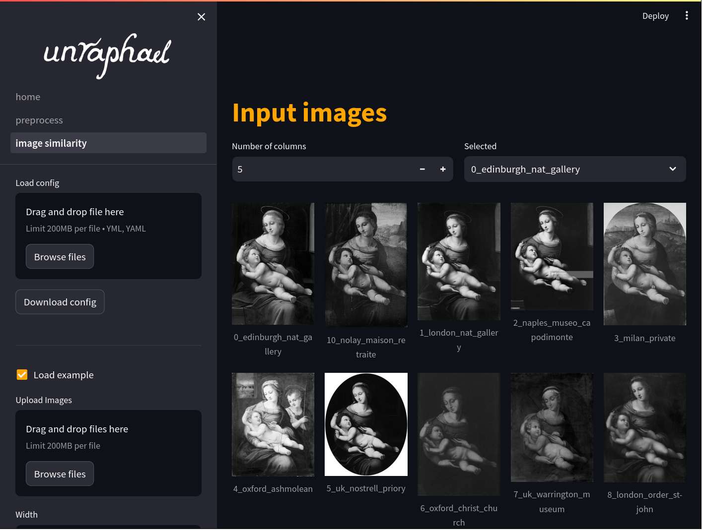
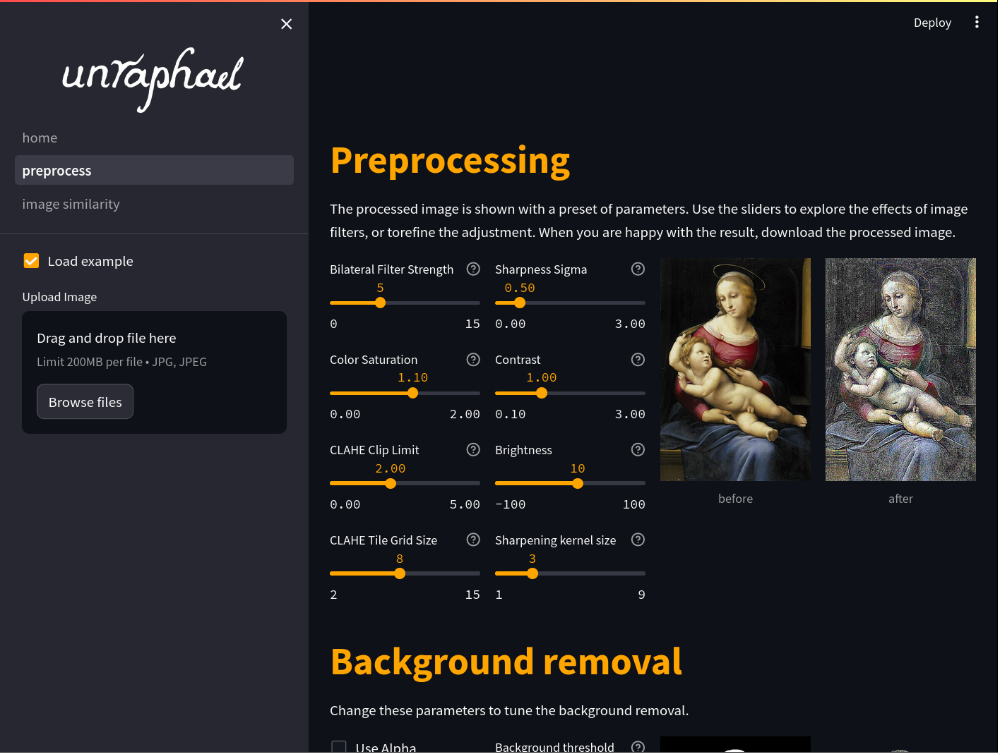
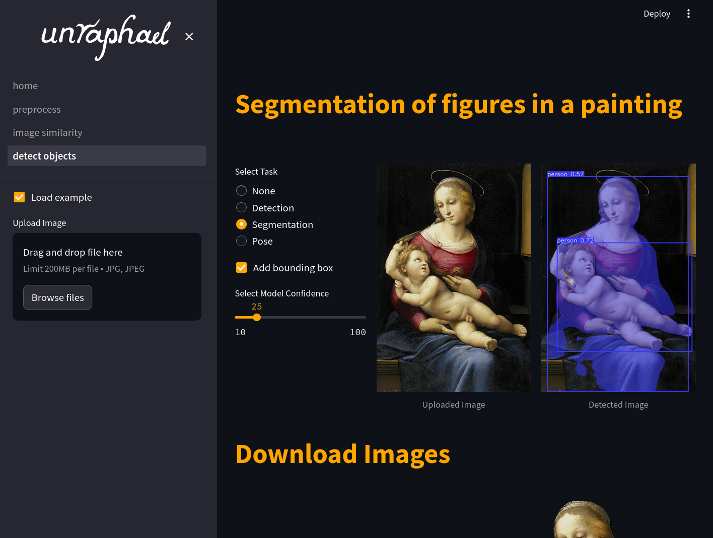

[](https://unraphael.readthedocs.io/en/latest/?badge=latest)

[](https://github.com/DecodingRaphael/unraphael/actions/workflows/tests.yaml)
[](https://pypi.org/project/unraphael/)
[](https://pypi.org/project/unraphael/)
[](https://doi.org/10.5281/zenodo.11192044)


# Unraphael

**Unraphael** is a digital workflow tool that uses computer vision to unravel the artistic practice of Raphael (Raffaello Sanzio, 1483-1520), while providing new digital approaches for the study of artistic practice in art history. Dozens of faithful reproductions survive of Raphael's paintings, attesting to the lucrative practice of serial production of paintings within the artist's workshop and to the lasting demand for the master's designs. This tool aims to provide new insights into Raphael's working methods through new digital approaches for the study of artistic practice in art history.

To install:

```console
pip install unraphael
```

## Try unraphael in your browser!

You can also [try unraphael directly from your browser](https://unraphael.streamlit.app/).

| <a href="https://unraphael.streamlit.app/image_similarity"></a> | <a href="https://unraphael.streamlit.app/preprocess"></a> | <a href="https://unraphael.streamlit.app/detect"></a> |
| - | - | - |
| [Image similarity](https://unraphael.streamlit.app/image_similarity) | [Image preprocessing](https://unraphael.streamlit.app/preprocess) | [Object detection](https://unraphael.streamlit.app/detect) |

## Using the unraphael dashboard locally

To install and use the dashboard locally:

```console
pip install unraphael[dash]
unraphael-dash
```

## Development

Check out our [Contributing Guidelines](CONTRIBUTING.md#Getting-started-with-development) to get started with development.

Suggestions, improvements, and edits are most welcome.
