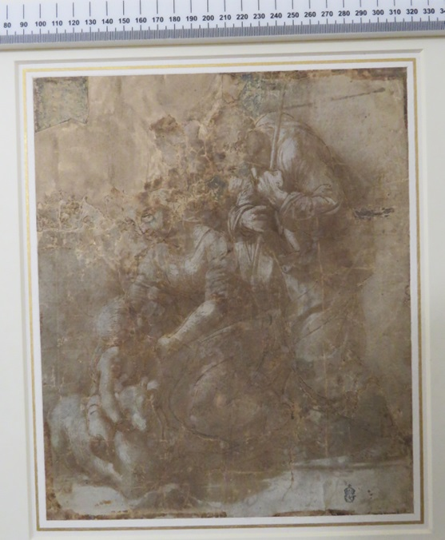
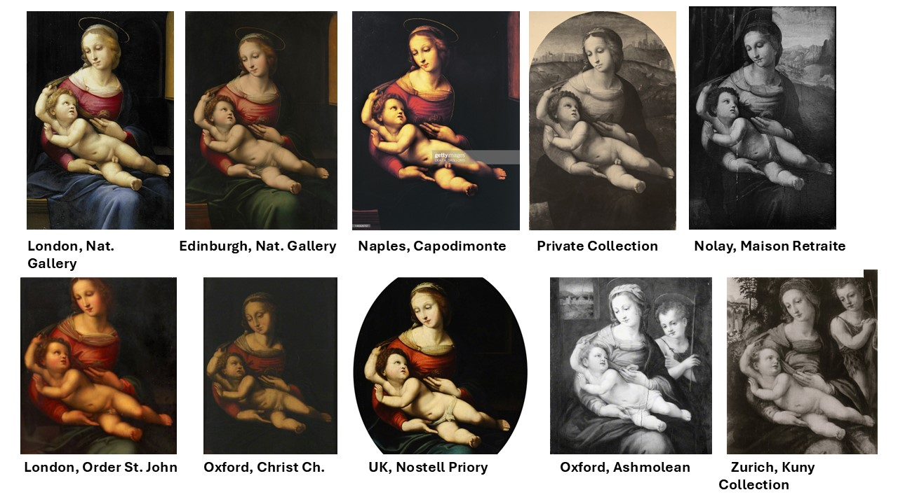

# Abstract

### The Lucrative Practice of Reproducing Paintings in the 16th Century

During the 16th century, the reproduction of paintings became a significant and lucrative practice in Renaissance Italy. Artists and workshops often created multiple versions of popular works, both to meet the high demand and to spread the influence of renowned masters. This practice allowed artists to capitalize on successful compositions and provided patrons with highly sought-after artworks, even if they were not original pieces.

### Raphael's Use of Detailed Templates

One of the most famous artists associated with the practice of reproducing paintings was Raphael. He was known for his meticulous use of detailed templates, which served as guides for his artworks. These templates allowed Raphael and his workshop to produce multiple versions of a painting with a high degree of consistency and quality.

As a result, dozens of faithful reproductions of Raphael's paintings survive today, offering insights into the techniques and processes used in his workshop.

---

## Different Copying Methods

### Tracing of Lines and Impressing Chalk

One common method of copying involved tracing the lines of a composition and then impressing the outlines onto a new surface using chalk. This technique ensured that the proportions and layout of the original design were accurately transferred to the copy, serving as a reliable foundation for further work.

### Pouncing by Pricking

Pouncing, another popular method, involved pricking small holes along the lines of a design and then dusting the surface with powdered charcoal or chalk. This process created a series of dots that could be connected to replicate the original image. Pouncing was particularly useful for reproducing intricate details and was often employed for large-scale frescoes or altarpieces.

### Squaring with a Grid

The squaring method used a grid to divide the composition into smaller squares, allowing the artist to copy the image square by square. This method was especially effective for ensuring accurate proportions and was widely used for scaling up smaller drawings or sketches to larger canvases or walls.

### Freehand Copying

Finally, freehand copying relied on the skill and experience of the artist to replicate the original composition by eye. While this method allowed for greater artistic interpretation and flexibility, it required a high level of expertise and often resulted in variations between the original and the copy.

---

## Aim
This background information highlights the historical context and various methods of copying paintings in Renaissance Italy, which are relevant to understanding the significance of image alignment and clustering in art historical research. The Streamlit app leverages modern computational techniques to explore these historical practices, offering insights into the similarities and differences between artworks that were produced using these traditional methods. A computational approach to the above sketched phenomenon enables the comparison of an unlimited number of paintings using photographs alone with millimetre-precise accuracy.

This approach can be used to answer questions such as:

- Can computer vision methods identify different copying methods used in the reproductions of Raphael’s paintings? 
- Based on the computed variations in the design of copies, what is the genealogical relationship between the original paintings and its variants? Which copies could come from Raphael’s workshop?

## Results
Developed in python, **Unraphael** is a toolbox for obtaining insight into structural similarities and differences between the original painting and its copies. It relies on computer vision algorithms to extract the outlines of the figures and compare these across paintings, revealing how these relate to each other (smaller variations revealing closer affinities), and copying practices (identical outlines denoting a mechanical method of transferring the compositions). Such comparisons have been undertaken manually, on a small number of cases, but never computationally, and as such **Unraphael** has the potential to revolutionise art historical methods for studying art.

 The input for **Unraphael** can be a set of images in *jpg* or *png*. In case of using the app, a target directory can be selected where these images are stored.

 Finally, **Unraphael** is:

- easy to use
- open-source
- reproducible
- scalable
- customizable
- extendable
- maintainable
