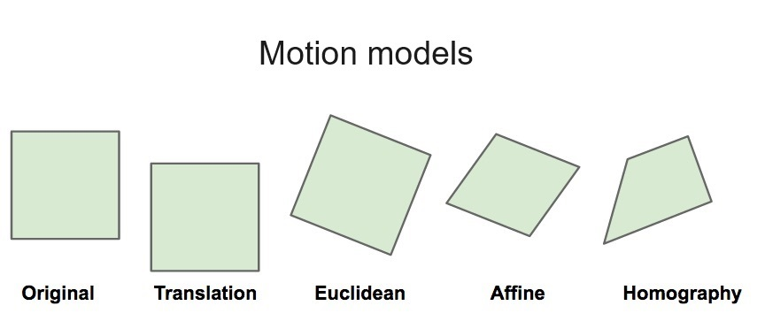

# Image Alignment

## Overview

The **Image Alignment** page in this Streamlit app allows you to align multiple images to a selected base image. This feature is essential for comparing or combining images with a consistent reference frame. Follow the steps below to effectively use the tools provided on this page.

---

## Step-by-Step Guide

### 1. **Upload Images**
- **Action**: Begin by uploading the images you want to align using the sidebar.
- **Instructions**:
  - Click on the "Upload" button in the sidebar.
  - Select the images from your device.
  - Ensure that all images are in the desired format and properly uploaded before proceeding.

### 2. **Select the Base Image**
- **Action**: Choose the image that will serve as the reference for aligning all other images.
- **Instructions**:
  - After uploading, the images will be displayed on the main page.
  - Scroll down to the "Select base image" section.
  - Click on the image you want to use as the base. This image will appear highlighted. All other images will be aligned to this base image.

### 3. **Equalize Image Properties (Optional)**
- **Action**: Since we are particularly interested in assessing and comparing the structural similarity of the images, it may be helpful to make the images similar on non-structural features such as **Brightness**, **Contrast**, **Sharpness**, and **Color**. Therefore, if wanted, adjust these properties of the images to match the base image, ensuring uniformity before alignment.
- **Instructions**:
  - In the left column, under "Equalization parameters," you’ll find several checkboxes.
  - Options include **Brightness**, **Contrast**, **Sharpness**, **Color**, and **Reinhard Color Transfer**.
  - Select the checkboxes as needed to apply these adjustments to all images relative to the base image.
  - The images will be processed based on the selected options.

### 4. **Align Images**
- **Action**: Align the selected images to the base image using one of several methods.
- **Instructions**:
  - In the right column, under "Alignment parameters," choose an alignment method from the dropdown menu labeled **Alignment procedure**.
  - The currently available alignment methods - explained in more detail below in 4a - include:
    - **Feature Based Alignment**: Aligns images using detected features (e.g., SIFT, SURF, ORB).
    - **Enhanced Correlation Coefficient Maximization (ECC)**: Maximizes correlation between images.
    - **Fourier Mellin Transform (FMT)**: Aligns images based on frequency content.
    - **FFT Phase Correlation**: Aligns images using phase correlation in the Fourier domain.
    - **Rotational Alignment**: Aligns images by correcting rotational differences.
    - **User-Provided Keypoints**: Uses custom keypoints for alignment (if available).
  - Depending on the selected method, you may need to choose additional options like **Motion Models** (see 4b) or **Normalization Methods**.
  - The alignment process will run, and a progress bar will show the status of the alignment.

### 4a. Alignment Methods Overview

### Feature Based Alignment
**Description**: Feature Based Alignment detects distinct features in images, such as edges or corners, using algorithms like SIFT, SURF, or ORB. It then matches these features between images to estimate transformations such as translation, rotation, and scaling.  
**Usefulness**: This method is highly effective for aligning images with clear, identifiable features and is suitable for complex transformations where multiple aspects of an image might differ from the base image.

### Enhanced Correlation Coefficient Maximization (ECC)
**Description**: ECC Maximization aligns images by finding the geometric transformation that maximizes the correlation coefficient between them. This method is robust against noise and variations in lighting conditions.  
**Usefulness**: ECC is ideal for aligning images with small to moderate transformations, especially when accuracy in matching the overall structure of the images is critical.

### Fourier Mellin Transform (FMT)
**Description**: The Fourier Mellin Transform method aligns images based on their frequency content by first converting the images into the frequency domain. It is rotation and scale invariant, which makes it suitable for handling images that have undergone rotational or scaling transformations.  
**Usefulness**: FMT is useful when images are misaligned due to rotations or scaling but can be computationally intensive, making it better suited for scenarios where accuracy is more important than speed.

### FFT Phase Correlation
**Description**: FFT Phase Correlation aligns images by calculating the phase correlation between their Fourier transforms. It is particularly effective at detecting and correcting translational shifts.  
**Usefulness**: This method is optimal for cases where the primary misalignment is translational, but it may struggle with images that require rotational or scaling corrections.

### Rotational Alignment
**Description**: Rotational Alignment focuses solely on aligning images by finding the optimal rotation angle to minimize the difference between them. This method is straightforward and specifically targets rotational discrepancies.  
**Usefulness**: Best used when rotation is the primary misalignment issue, and there is no need for other types of transformations such as scaling or translation.

### User-Provided Keypoints
**Description**: This method aligns images based on keypoints provided by the user, which may be derived from external processes like pose estimation. The alignment process uses these custom keypoints to adjust the images accordingly.  
**Usefulness**: User-provided keypoints are particularly useful when automated feature detection methods fail or when the user requires precise control over the alignment process based on specific reference points.

### 4b. Motion models

Motion models describe different types of geometric transformations used to align images. Each model addresses specific types of misalignments. The available motion models include (see image below):

### Translation
Translation adjusts the position of an image by shifting it horizontally or vertically. It is useful when the primary misalignment involves shifting the image along the x or y axis. This model is ideal for correcting simple positional errors without altering the image's orientation or scale.

### Euclidean
Euclidean transformations include translation along with rotation and uniform scaling. This model preserves the shape of the image but allows for rotation and scaling adjustments. It is suitable when images differ only by rotation and scaling, and it maintains the overall proportions of the image.

### Affine
Affine transformations extend Euclidean transformations by allowing non-uniform scaling and shearing. This model can handle more complex distortions such as perspective changes and skewing. It is useful for aligning images where the misalignment involves both stretching and shearing distortions.

### Homography
Homography models account for more complex transformations, including perspective distortions and varying depths. It maps points from one image to another using a projective transformation, making it ideal for aligning images taken from different viewpoints or with significant perspective changes. This model is particularly useful in panoramic stitching and when handling images with large perspective shifts.

### 5. **View Help for Alignment Methods**
- **Action**: Access detailed information about each alignment method.
- **Instructions**:
  - Click on the **Help for parameters for aligning images** expander at the bottom of the alignment section.
  - Read through the descriptions to understand the strengths and weaknesses of each alignment method.
  - This section is particularly useful if you’re unsure which alignment method to choose.

### 6. **Compare Aligned Images**
- **Action**: Compare the aligned images with the base image to evaluate the results.
- **Instructions**:
  - Scroll to the **Comparison** section at the bottom of the page.
  - Use the dropdown menu on the left to select an aligned image for comparison.
  - The selected image will be displayed side-by-side with the base image.
  - Relevant metrics for the selected image will be shown beneath the dropdown.
  - You can download the images by clicking the **Download** buttons for further analysis.

---

## Tips for Effective Use

- **Selecting the Right Alignment Method**: The choice of alignment method depends on the specific characteristics of your images. If you are working with images that have clear, distinct features, **Feature-Based Alignment** might be the best option. For images requiring precise geometric transformations, **ECC Maximization** could be more suitable.
- **Using Equalization**: Equalizing images before alignment can significantly improve the quality of the alignment, especially in cases where images differ in lighting, contrast, or color balance.

---

## Conclusion

The Image Alignment page walks you through the process of aligning images. By following these steps, you can ensure that your images are correctly aligned and ready for further analysis or processing. If you have any further questions or need further assistance, refer to the help section within the app, or look at the following links.
