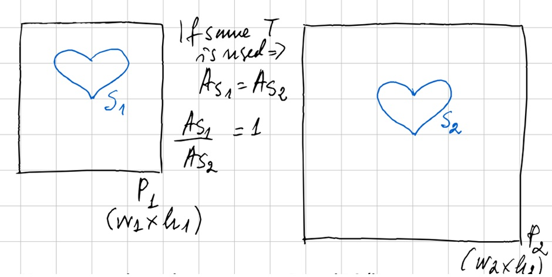
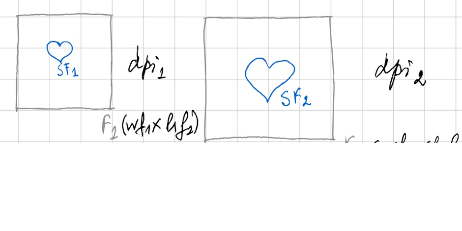

## Estimating the absolute area in the paintings based on photos

### Background
From images/ photos of a set of paintings (i.e., original and copies), the outlines of the figures can be overlaid with information about the actual size of the paintings. Here, we offer a precise way of computing the size of the outlines and of analysing the degree in variations between the original and later copies. This allows us to verify if the same template was used to produce the outlines of figures in different paintings. Since we only have digital photos and not the physical paintings themselves, we need to estimate the areas of connected components (i.e., the grouped figures, or else the main figure when there is only one) from the photos.

### Procedure
Lets denote two paintings as *P1* and *P2* and their corresponding photos as *F1* and *F2*. We would like to verify whether the same template *T* has been used to produce the same "connected component" shape *S*. That shape consists of several touching figures in the painting and is represented by shape *S1* in *P1* and *S2* in *P2*, respectively. If the same *T* is used, then the area of *S1* should be the same as the area of *S2*, or the ratio of their areas should be 1.

However, we do not have access to *P1* and *P2*; hence, we cannot measure the areas of *S1* and *S2*, but we do have access to *F1* and *F2* and we do have the dimensions of both painting and photos in cm. We also have the size of the photos in pixels and the dpi (which relates the sizes in cm and in pixels). Lets denote the shapes in the digital photos as *SF1* and *SF2*.

We need to check how close the ratio is of corrected areas (calculated in number of pixels with the DPI and scaling correction) of SF1 and SF2 to 1. The areas in number of pixels for the shapes (connected components after the image segmentation) can be calculated by using any standard image processing library, e.g. using skimage. The correction/normalization of the areas with the pixel size can de done by dividing the physical dimension to the pixel dimension. That is the dpi.

The scaling factor is a bit more tricky to calculate precisely, not knowing if the digital image has undergone some geometric post-processing such as cropping. (The real painting dimension and the photo ratios indicate some discrepancies, though not so big). One way is to use the scale factor from the homography derived from SIFT or other feature matching method. However, we are not matching exactly the same images hence, we cannot rely to a perfect precision. So, alternatively, we can use the average between the ratios as an estimation of the scaling factor. Then the corrected areas would be:

 = A x (pixel size/ dpi) x scaling factor

(with A in amount of pixels)

This then allows us to answer how similar the areas of the main outlines in two paintings are, after accounting for differences in the sizes of the paintings and their corresponding photos.

### Steps to Follow

1. **Upload Images and Real Sizes:**
   - **Upload Photos:** Start by uploading the digital photos of the paintings.
   - **Upload Real Sizes:** Upload an Excel file containing the real dimensions of the paintings in centimeters.

2. **Overview of Image Sizes and DPI:**
   - **Check Image Metrics:** Review the sizes and DPI of the uploaded images. This information helps in converting pixel measurements to physical dimensions.

3. **Select and Prepare the Base Image:**
   - **Choose Base Image:** Select a base image for alignment from the uploaded photos.

4. **Equalize Images (Optional):**
   - **Equalize Image Properties:** Adjust the brightness, contrast, and other properties of the images to make them more comparable.

5. **Align Images:**
   - **Choose Alignment Method:** Select an alignment method from various options such as feature-based alignment, enhanced correlation, or others.
   - **Align Images to Base:** Align all images to the chosen base image to ensure consistent size and orientation.

6. **Compute Areas of Connected Components:**
   - **Segment Images:** Use image processing to segment the connected components in each photo.
   - **Calculate Area in Pixels:** Measure the area of the largest connected component in pixels.

7. **Convert Pixel Areas to Physical Dimensions:**
   - **Compute Photo Size in cm:** Convert the size of the photo from pixels to centimeters using the DPI information.
   - **Estimate Scaling Factor:** Determine the scaling factor based on the real dimensions of the painting and the dimensions of the photo.

8. **Calculate Corrected Areas:**
   - **Adjust Areas for Scaling:** Convert the pixel area to the actual size of the painting using the scaling factor.

9. **Compare Areas:**
   - **Compute Area Ratios:** For each pair of paintings, calculate the ratio of their corrected areas.
   - **Check for Similarity:** Compare the ratios to 1.0 to determine if the areas are approximately equal, using a set tolerance for minor discrepancies.

### Detailed Code Overview

- **Compute Size in cm:** Converts pixel dimensions to centimeters based on DPI.
- **Create Mask:** Segments the image to isolate connected components.
- **Calculate Corrected Area:** Adjusts the pixel area to reflect real-world dimensions.
- **Equalize and Align Images:** Ensures consistency in image properties and alignment for accurate analysis.

By following these steps, you can systematically compare the areas of connected components in different paintings, even when only digital photos are available.
