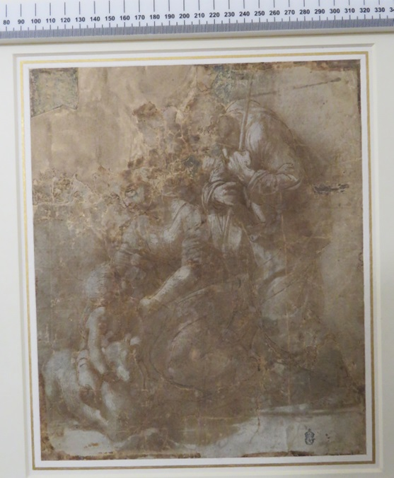
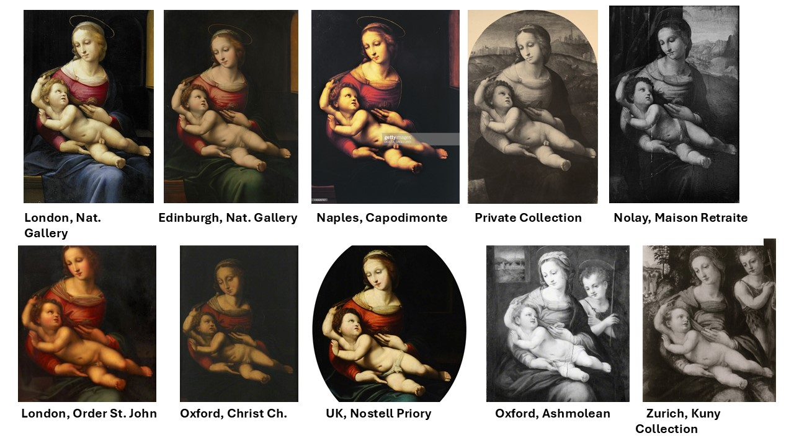

# Reproducing Paintings in the 16th Century

During the 16th century, the reproduction of paintings became a significant and lucrative practice in Renaissance Italy. Artists and workshops often created multiple versions of popular works, both to meet the high demand and to spread the influence of renowned masters. This practice allowed artists to capitalize on successful compositions and provided patrons with highly sought-after artworks, even if they were not original pieces.

## Raphael's Use of Detailed Templates

One of the most famous artists associated with the practice of reproducing paintings was Raphael. He was known for his meticulous use of  templates (i.e., detailed preparatory drawings), which served as guides for reproducing his artworks. These templates allowed Raphael and his workshop to produce multiple versions of a painting with a high degree of consistency and quality.

As a result, dozens of faithful reproductions of Raphael's paintings survive today, offering insights into the techniques and processes used in his workshop.

## Different Copying Methods

### Pouncing (Spolvero)
A preparatory drawing is pricked with small holes along the design’s outlines using a fine tool like a needle. This pricked cartoon is placed on the new surface, and a cloth bag filled with powdered charcoal or chalk is tapped over it. The powder passes through the holes, leaving a series of dots on the surface below, which can then be connected to outline the composition. This technique allows for precise and repeatable transfers, crucial for creating multiple copies.

### Tracing of Lines and Impressing Chalk (Calco)
The artist would smudge charcoal on the back of the sheet itself before tracing the outlines of the design. The original design is placed over a new surface, and its outlines are traced using a stylus or sharp tool, leaving indentations on the underlying surface. It could also be done using the verso of a separate sheet placed underneath the first sheet. The artist would then press heavily on the pointed tool he used for transferring his designs, hence tracing more fluidly the drawing on the paper while minimising the damages caused to the original design. This method ensures that the key elements of the composition (i.e. ussually the main figures) are accurately transferred, providing a reliable guide for the subsequent painting process on the canvas.

### Squaring with a Grid
The original image is divided into a grid of equal squares, which is replicated on the new surface. Each square of the original is then copied individually, focusing on the details within that specific section. This method is particularly useful for enlarging or reducing the scale of the image while maintaining accurate proportions. It also helps in transferring complex compositions by breaking them down into manageable parts.

###  Freehand Copying
In freehand copying, the artist redraws the original design directly onto a new surface without mechanical aids. This requires the artist to rely on their visual memory and drawing skills to replicate the composition. Variations in the copy can occur due to the interpretative nature of this method, allowing for artistic freedom but requiring a high level of expertise to ensure fidelity to the original.

## Aim
This background information highlights the historical context and various methods of copying paintings in Renaissance Italy, which are relevant to understanding the significance of image alignment and clustering in art historical research. The Streamlit app leverages modern computational techniques to explore these historical practices, offering insights into the similarities and differences between artworks that were produced using these traditional methods. A computational approach to the above sketched phenomenon enables the comparison of an unlimited number of paintings using photographs alone with millimetre-precise accuracy. This approach can be used to answer questions such as:

- Can computer vision methods identify different copying methods used in the reproductions of Raphael’s paintings? 
- Based on the computed variations in the design of copies, what is the genealogical relationship between the original paintings and its variants? Which copies could come from Raphael’s workshop?

## Results
Developed in python, **Unraphael** is a toolbox for obtaining insight into structural similarities and differences between the original painting and its copies. It relies on computer vision algorithms to extract the outlines of the figures and compare these across paintings, revealing how these relate to each other (smaller variations revealing closer affinities), and copying practices (identical outlines denoting a mechanical method of transferring the compositions). Such comparisons have been undertaken manually, on a small number of cases, but never computationally, and as such **Unraphael** has the potential to revolutionise art historical methods for studying art.

 The input for **Unraphael** can be a set of images in *jpg* or *png*. In case of using the app, a target directory can be selected where these images are stored.
