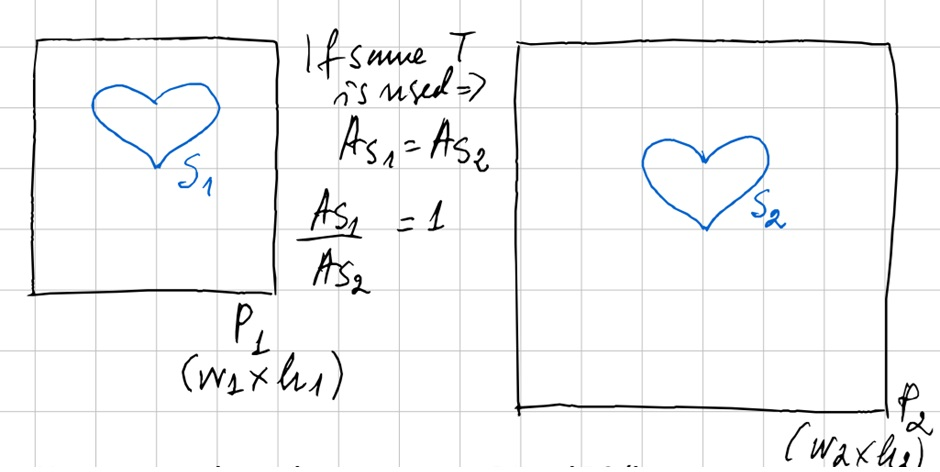
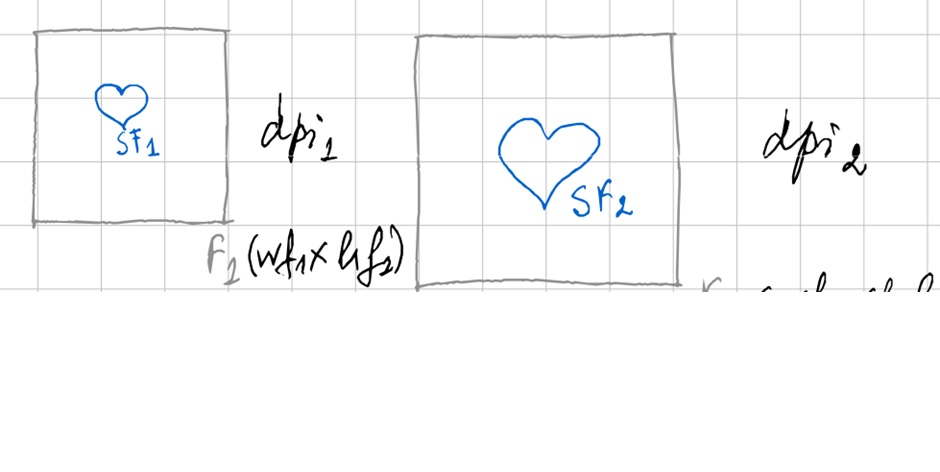
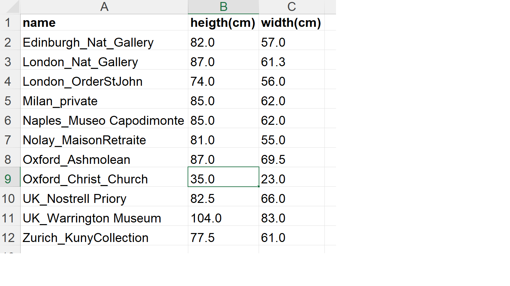
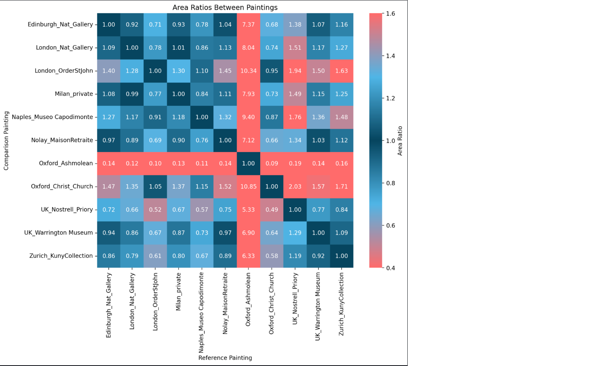
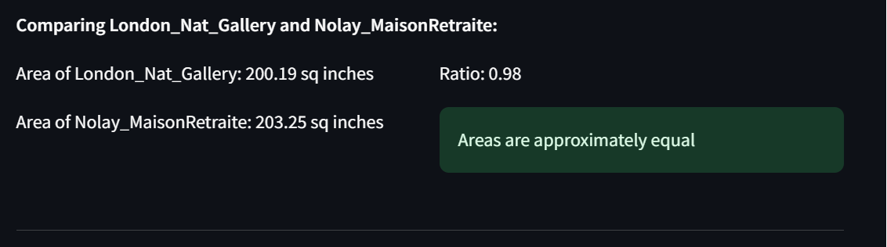

# Estimating the absolute area in the paintings based on photos

From photos of a set of paintings (including the original and copies), the outlines of the figures can be overlaid with information about the actual size of the paintings. Here, we offer a precise way of computing the size of the outlines and of analysing the degree in variations between the original and later copies. This allows us to verify if the same template was used to produce the outlines of figures in different paintings. Since we only have digital photos and not the physical paintings themselves, we need to estimate the areas of connected components (i.e., the grouped figures, or else the main figure when there is only one) from the photos.

So, the corresponding tool in the app compares the areas of the figures in the photos, but applies corrections to estimate what the areas would be in the real paintings. Similar area ratios (close to 1) between two paintings may indicate the use of the same template being used to reproduce the same figure.

## Procedure

Lets denote two paintings as *P1* and *P2* and their corresponding photos as *F1* and *F2*. We would like to verify whether the same template *T* has been used to produce the same "connected component" shape *S*. That shape consists of several touching figures in the painting and is represented by shape *S1* in *P1* and *S2* in *P2*, respectively. If the same *T* is used, then the area of *S1* should be the same as the area of *S2*, or the ratio of their areas should be 1.

However, we do not have access to *P1* and *P2*; hence, we cannot measure the areas of *S1* and *S2*, but we do have access to *F1* and *F2* and we do have the dimensions of both painting and photos in cm. We also have the size of the photos in pixels and the dpi (which relates the sizes in cm and in pixels). Lets denote the shapes in the digital photos as *SF1* and *SF2*.

We need to check how close the ratio is of corrected areas (calculated in number of pixels with the DPI and scaling correction) of SF1 and SF2 to 1. The areas in number of pixels for the shapes (connected components after the image segmentation) can be calculated by using any standard image processing library, e.g. using skimage. The correction/normalization of the areas with the pixel size can de done by dividing the physical dimension to the pixel dimension. That is the dpi.

The scaling factor is a bit more tricky to calculate precisely, not knowing if the digital image has undergone some geometric post-processing such as cropping. (The real painting dimension and the photo ratios indicate some discrepancies, though not so big). One way is to use the scale factor from the homography derived from SIFT or other feature matching method. However, we are not matching exactly the same images hence, we cannot rely to a perfect precision. So, alternatively, we can use the average between the ratios as an estimation of the scaling factor. Then the corrected areas would be:

 = A x (pixel size/ dpi) x scaling factor

(with A in amount of pixels)

This then allows us to answer how similar the areas of the main outlines in two paintings are, after accounting for differences in the sizes of the paintings and their corresponding photos.

## Steps to Follow in the App

1. **Upload Data on the Sizes of the Real Paintings, and the corresponding Photos:**
   - **Upload Painting Dimensions:** Upload an Excel file containing the real dimensions of the paintings in centimeters. Ensure that the list of images are alphabetically ordered, so that they match the order of the images loaded in the next step.

   - **Upload Photos:** Upload the digital photos of the paintings from a folder on your computer. For now, use the *unaligned photos*, preferably with the background removed.
   
1. **Overview of Image Sizes and DPI:**
   - **Check Image Metrics:** Review the sizes and DPI of the uploaded images. This information helps in converting pixel measurements to physical dimensions.

2. The app will automatically show the main figure masks, used to compute the areas of the connected components.

3. Set the tolerance for area comparison. This tolerance is used to determine if the areas of the connected components in the two paintings are similar.

4. The analysis will then show the ratio of the areas of the connected components in two real paintings. If the ratio is close to 1, then the main figures in the two paintings are similar. This is shown via a heatmap (see example image below):

- The heatmap is symmetric around 1, meaning both higher and lower ratios will be treated similarly
- Values close to 1 appear in dark blue. As values deviate from 1, they transition to lighter blue
- Extreme values (both high and low) will transition to the coral color

5. More detailed information is provided in the table below the heatmap indicating whether the areas of the main figures in the two paintings are similar, given the set tolerance.

