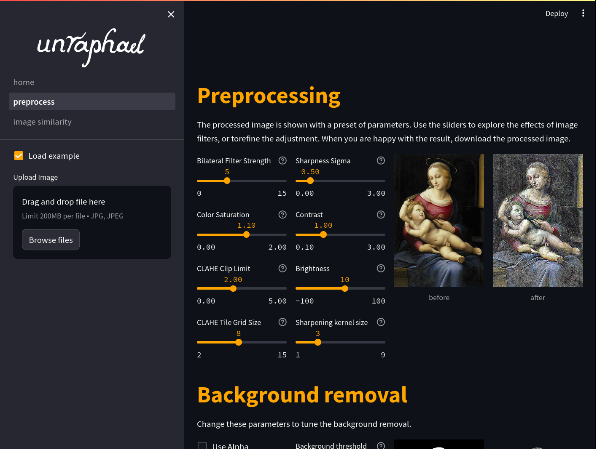
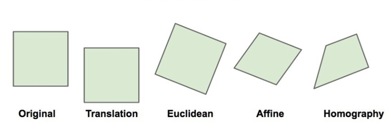
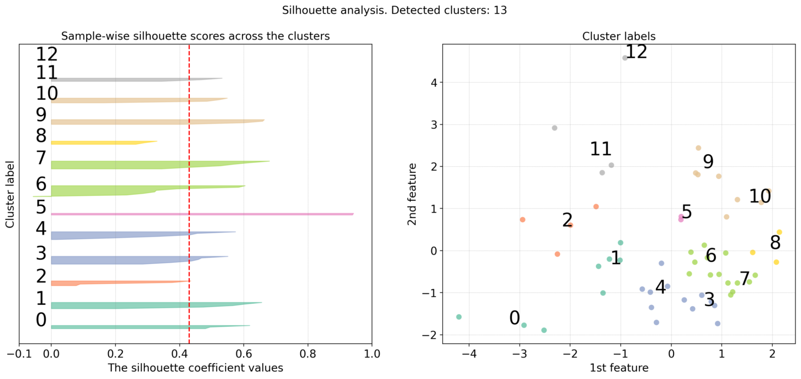

# Summary

Inspired by the Renaissance painter Raphael and the artistic practices of making reproductions,`Unraphael`[@vroegh2024] is a Python workflow tool designed to enhance the analysis of paintings and their copies. It is designed to streamline the preprocessing, background removal, image alignment, outline extraction, and clustering of photographs of these paintings, grouping the images into similarity-based clusters. The tool specifically targets the challenge of comparing near-identical images by offering a comprehensive pipeline that includes state-of-the-art similarity measures, clustering techniques, together with several options for close visual inspection. Unraphael facilitates easy quantitative comparison of extracted figure-outlines across reproductions. Integrated with a user-friendly Streamlit interface, the package provides an efficient, flexible and accessible solution for researchers in digital humanities and art history to analyse and interpret visual data.

# Statement of need

Attributing and authenticating paintings are essential but complex tasks in art history, conservation, and the commercial art world [@bolz2022]. Traditional approaches to art attribution often rely on the study of ownership and exhibition history, material analysis such as the chemical composition of pigments, thematic content, and the examination of stylistic and technical characteristics within an artist’s oeuvre [@ugail2023]. These methods are complemented by connoisseurship — the close visual analysis of a work’s composition, brushwork, and stylistic nuances — which has long been the domain of art experts. Comparing and authenticating reproductions of artworks has been a notorious labour-intensive process, constrained by manual examination and limited case studies. Similarly, identifying stylistic patterns and copying techniques is often constrained by the limitations of these manual analyses [@bambach1999].

`Unraphael` addresses this challenge by providing an integrated pipeline that automates the essential steps—preprocessing, segmentation, alignment, and clustering analysis based on structural similarities—through an intuitive and easy-to-use interface. In contrast to recent advancements in deep - and machine learning [@smith2024] as well as GPT-based agents [@tang2024], which have greatly influenced the authentication and attribution of fine art in art-historical research [@stork2023], `Unraphael` avoids these black box methods to ensure that the applied techniques can be interpreted and better understood by researchers from the art-historical domain. It combines third-party algorithms from well-known Python libraries from the computer vision domain (e.g., openCV and scikit-image), allowing researchers to focus on interpreting analytical results rather than managing complex image processing tasks. It is open-source and available on `github` [@unraphael] under the Apache 2.0 license.

# Overview

`Unraphael` integrates several image-processing functionalities into a cohesive pipeline, which can be used in sequence or independently from each other. It is supported by a [streamlit application](https://unraphael.streamlit.app) which offers an interactive web-based environment for conducting and visualizing the analyses. Its user-friendly interface guides researchers through the entire process from data ingestion to result interpretation, enhancing the overall analytical experience. Several tutorials are available on the accompanying [documentation page](https://unraphael.readthedocs.io/en/latest/), demonstrating how  `Unraphael` can be applied using a small dataset of reproductions of paintings. The first **preprocessing page** allows to upload one or multiple images (in *jpg* or *png*) and enables standardization of images through resizing, colour normalization and enhancement to ensure consistency across images (see \autoref{fig:dash_preprocess}).

The following tools are available for preprocessing:

- Bilateral Filter Strength: This filter smooths the image while preserving edges, useful for reducing noise while keeping important details intact.
- Color Saturation: Adjusts the vibrancy of colours in the image, enhancing saturation which makes features stand out more clearly.
- CLAHE (Contrast Limited Adaptive Histogram Equalization): Enhances local contrast in the image, making details in darker or lighter regions more visible.
- Sharpness Sigma: Controls the sharpness of the image by applying a sharpening filter, which can help highlight fine details.
- Gamma: Adjusts the brightness and contrast of the image.
- Gain: Similar to gamma, but specifically enhances the overall brightness of the image.
- Sharpening Radius: Defines the extent of the sharpening effect applied to the image.

In addition, several options exist which help to control the background removal process. Ultimately, the extracted figures in the foreground can be saved and used for subsequent analysis.

The **segmentation page** allows to isolate key objects within each image such as foregrounded individual figures for more focused analysis. Additionally, analysing the pose structure enables a first visual comparison between the images. Next, the **alignment page** allows to align multiple images to a selected base image. This feature is essential for comparing or combining images with a consistent reference frame. If wanted, adjust non-structural features such as brightness, contrast, sharpness, and colour to match the base image, ensuring uniformity before alignment and allowing optimal (visual) comparison. Images can be aligned using:

- Feature-based alignment: Aligns images using detected features based on SIFT, SURF or ORB.
- Enhanced correlation coefficient maximization: Maximizes correlation between images.
- Fourier Mellin transform: Aligns images based on frequency content.
- FFT phase correlation: Aligns images using phase correlation in the Fourier domain.
- Rotational alignment: Aligns images by correcting rotational differences.

In addition, several motion models are available (see \autoref{fig:motion_models}). These models are used to describe the transformation between the base image and the other images.

To facilitate detailed visual analysis, a slider to compare the base and aligned image is available, as well as overlapping contours with accompanying similarity metrics such as *Frechet*-, *Procrustes*- and *Hausdorff* distances, and an animation going back and forth between images.

The **cluster page** of `Unraphael` is specifically designed to cluster based on the structural aspects of the image, while being resilient to noise, outliers, or variations in the data [@yang2004]. First, the option exists to equalizing brightness, sharpness, and contrast to reduces variations due to lighting or photography conditions. For instance, copies of paintings may have been photographed under different lighting conditions, or might have been printed or created with different sharpness and contrast levels. Equalizing these factors ensures that the clustering focuses on the actual structure of the images, not on extraneous factors like lighting or image quality.

Next, aligning images to their mean helps ensuring that the key elements of each image are in the same spatial location across the images. This is critical for structural similarity metrics, which assume that the images being compared are geometrically aligned. Clustering takes place on either the foregrounded figures in the image (i.e., with background removed) or the outer contours of these figures. In the former, clustering is based on a) the extracted features from the figures or b) a similarity matrix containing pairwise structural similarity indices. These indices include the *Structural Similarity Index* [@wang2004], *Complex Wavelet Structural Similarity Index* [@sampat2009] and a metric for *brushstroke signatures* based on a combination of edge detection techniques [@ugail2023]. *Spectral clustering*, *density-based spatial clustering of applications with noise* (DBSCAN) and *affinity propagation* are among the available cluster methods suited to work with these similarity matrices. To assess the effectiveness of the clustering process, performance metrics such as the *Silhouette-* *Davies-Bouldin-* and *Calinski Harabasz score* are available. These metrics provide valuable insights into the cohesion and separation of clusters, ensuring that the groupings reflect meaningful similarities. The process is complemented by several visualizations, including a dendrogram to visualize relationships between the paintings, and a silhouette- with a scatterplot to map out clusters on a 2D projection using Principal Component Analysis to depict how the images group together into clusters (see \autoref{fig:silhoutte_plot}).

# Conclusion

`Unraphael` offers an integrated solution for examining the visual relationships between original works of art and their copies or derivatives, providing new insights into the mechanical and artistic strategies used in reproduction. This computational approach not only aids in understanding copying methods—such as the use of templates—but also contributes to broader discussions in art history about the transmission of compositions and techniques across time and geography. While our methodology represents a significant advancement in computational art analysis, it complements, rather than completely replaces, traditional authentication methods.

# Acknowledgements

We acknowledge contributions from Christiaan Meijer and Elena Ranguelova for scientific input and helpful discussions guiding the development of `Unraphael`.

# References
